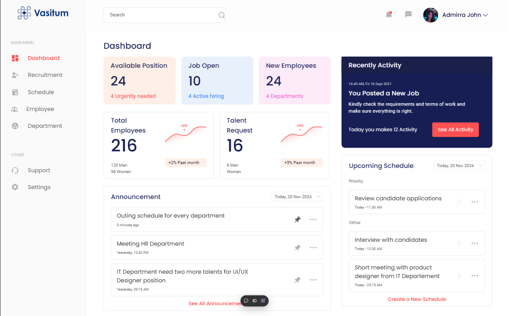
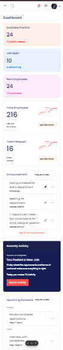

# Frontend Developer Intern Assignment

This project is a responsive webpage built using React.js as part of an internship assignment. The design and functionality align with the provided Figma designs and guidelines.

## Live Demo
[Hosted Website Link](https://shoshin-tech-assignment-eight.vercel.app/)

## Features
- Responsive design for both desktop and mobile views.
- Developed using reusable React components.
- Styled with CSS for an engaging UI.
- Hosted on a free platform for review.

## Screenshots
### Desktop View


### Mobile View


## Installation and Setup
1. Clone the repository:
   ```bash
   git clone <https://github.com/codeVcreator/Shoshin-Tech-FrontEnd-intern-assignment.git>
   ```
2. Navigate to the project directory:
   ```bash
   cd Shoshin-Tech-FrontEnd-intern-assignment
   ```
3. Install dependencies:
   ```bash
   npm install
   ```
4. Start the development server:
   ```bash
   npm start
   ```
   The app will be available at `http://localhost:3000`.


## Components
### 1. **Card Component**
   - Displays information visually appealingly.
   - Reusable for different datasets.

### 2. **Graph-Card Component**
   - Provides a consistent navigation or branding area.
   - Styled for responsiveness.


## Technologies Used
- **React.js**: Library for building the user interface.
- **CSS**: For styling the components.
- **Create React App**: Boilerplate for initializing the project.
- **Free Hosting Platform**: For deploying the webpage.
